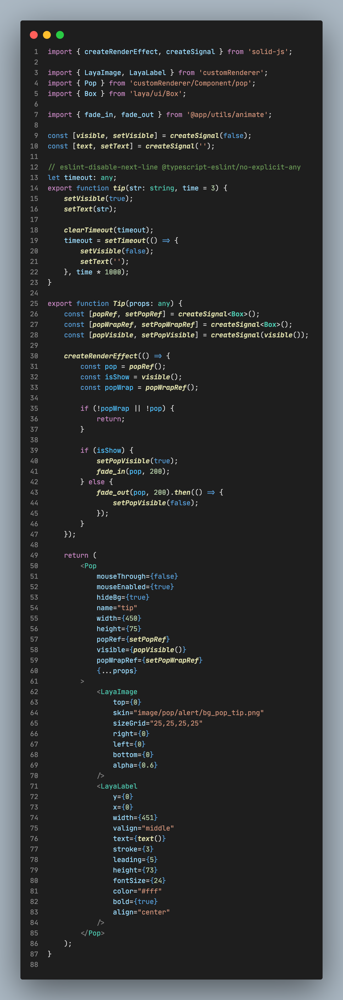

以下是个人的一些经典项目，由此可以清晰的看出我的技术水平；

## bitUI

一个自己写的 react 组件库：

[示例](https://zsytssk.github.io/bitUI)

[仓库](https://github.com/zsytssk/bitUI)

## calendar

一个自己写的 react 日历组件 （低仿飞书日历）

[示例](https://zsytssk.github.io/calendar)

[仓库](https://github.com/zsytssk/calendar)

## event-state 状态管理

自己写的 react 状态管理器, 采用事件分发来管理状态；
有类似 redux 的 useSelector 的方法

[react-event-state](https://www.npmjs.com/package/react-event-state)

[demo](https://zsytssk.github.io/event-state)
[介绍](https://www.jianshu.com/p/e6e1f6a89be3)

## 其他有关 react 其他

后台管理模版[admin-tpl](https://github.com/zsytssk/admin-tpl.git)

react 模版[react-pro-tpl](https://github.com/zsytssk/react-pro-tpl.git)

最新 react 模版[react-clean-tpl](https://github.com/zsytssk/react-clean-tpl.git)

我对 react 的理解 [网址](https://www.zhihu.com/question/47161776/answer/2325381843)

给 redux 的 useSelector 添加 debounce [网址](https://stackoverflow.com/questions/64799941/how-add-debounce-to-useselector-on-react-redux)

## 捕鱼

捕鱼是一款 layaBox 写的游戏，是我投入时间精力最大的游戏也是最能代表我实力的游戏；
在其中我实现了 MVC+honor 框架+ts 写的第一个游戏等等，这是比较详细的[介绍](./fish/readme.md)

## cocos 相关

[cocos-tpl](https://github.com/zsytssk/cocos-tpl.git)

- 功能：
  1. [资源管理器][utils]
  1. [音频管理器][utils]
  1. [弹框管理器][utils]
  1. [缓存管理器][utils]
  1. [prefab 管理器][utils]
  1. [websocket][utils]
  1. [i18n][i18n]

[utils]: https://github.com/zsytssk/cocos-tpl/tree/master/assets/main/scripts/utils
[i18n]: https://github.com/zsytssk/cocos-tpl/tree/master/assets/resources/i18n

## lightCanvas

自己写的 10k 左右的 canvas 渲染引擎类似于 layabox: [示例][lightcanvasdemo]，[源代码][lightcanvassource]

- 功能：
  1. 显示图片
  1. 控制 alpha
  1. 控制 pivot
  1. 控制 scale
  1. 显示文字
  1. 图片 sizeGrid
  1. 弹框

[lightcanvasdemo]: https://zsytssk.github.io/lightCanvas/
[lightcanvassource]: https://github.com/zsytssk/canvas_test/tree/master/lightCanvas

## solid-laya

通过 SolidJs 渲染 Laya 的示例项目, 他的好处：

1. 用 jsx 来组织 UI（会 react 的人都知道这个好处）
2. 提供近似原生 js 代码的性能

[示例](https://zsytssk.github.io/solidjs-laya)

[仓库](https://github.com/zsytssk/solidjs-laya-demo)

在这个项目中我写了一个脚本可以直接将 laya ui 转换为 jsx，[代码在这](https://github.com/zsytssk/solidjs-laya-demo/tree/master/script/uiToJsx), 我以前做了一个类似的 react 项目[react-laya](https://github.com/zsytssk/react-laya)

## solid-taro

通过 SolidJs 渲染 taro 的项目

demo 项目 [taro-solid-demo](https://github.com/zsytssk/taro-solid-demo)
对 taro 项目的改造

- 对 taro 的改造[taro](https://github.com/zsytssk/taro/tree/solid)
- 项目开发的记录[taro-solid-doc](https://github.com/zsytssk/taro-solid-doc)

## rust 相关

曾经一段时间我迷上了 rust，下面是我用 rust 做过的项目:

1. 切割大图生成缩略图 [clip-img][clip-img]
1. 合并图片生成图集 [combine-image][combine-image]
1. 2022 年 advent_of_code [advent_of_code][advent_of_code]
1. rust 内部发布镜像工具 [publish-cli][publish-cli]
1. 其他 rust 项目 [网址][rust-relative]

一直想用 rust 自己写一门语言，因为缺少相关知识而未能成行；
现在 rust 越来越流行，也许未来 rust 会成为整个软件世界的基础；

[clip-img]: https://github.com/zsytssk/clip_img
[combine-image]: https://github.com/zsytssk/combine_image
[advent_of_code]: https://github.com/zsytssk/advent_of_code
[publish-cli]: https://github.com/zsytssk/publish-cli
[rust-relative]: https://github.com/zsytssk?tab=repositories&q=&type=&language=rust&sort=

## font-creator

flutter 写的一个合并字体文件的插件：

[示例](https://zsytssk.github.io/font_creator)

[仓库](https://github.com/zsytssk/font_creator)

因为这个项目写了一个合并矩形的 dart 库 [rect_pack](https://pub.dev/packages/rect_pack)

## 去中心化钱包代码

总结的一些常用的去中心化钱包核心功能代码，实现统一的接口，实现功能有：

1. 登陆
1. 退出
1. 切换币种
1. 获取余额
1. 转账
1. 合约 Approve
1. 签名

[仓库](https://github.com/zsytssk/contract-wallet)

## 工作流程

工作这么多年我总结了一套比较有效率的工作方法，简单的介绍下：
在新建一个项目时，我会新建一个 doc 文件夹，再在其中新建一个 note.md;
所有的记录我会按照日期分割(`## 2022-03-02 10:07:59`), 在工作中所有的想法和问题和需要完成的任务都会记录下来；
通过 `@note` `@todo` `@ques` 分类，如果有完成的我就会将其移入今天的 `### end`分类下；
如果今天没有做到的比较重要的我会在明天移入当天的工作内容，其他的移入今天的 `### save` 分类下；
这个工作方法使我不需要花费额外精力的去记忆去总结，一切都一目了然，让我能几乎能抓住每一个想法思考；
再搭配番茄工作法，使我一天做了很多的事情，而不会因此疲惫，而且还有精力做些其他的事情，一切如此的顺畅且自然而然；
我想这是我工作这么多年的最大的财富。

这是我做这个项目的[记录](./doc/note.md)

## 其他

1. [ts-常用类型定义](./code/type.d.ts)
1. [其他总结的脚本](https://github.com/zsytssk/common/tree/master)
1. [cmd_flow](https://github.com/zsytssk/cmd_flow) vscode 插件在, terminal 一条一条执行命令
1. [test_builder](https://github.com/zsytssk/test_builder) 自己写的浏览器中运行的测试小框架
1. [script](https://github.com/zsytssk/script) 个人常用的 ts 脚本，包含本地文件操作+文本替换等功能
1. [sublime 插件](https://packagecontrol.io/packages/QuickOpen;)
1. [atom 插件](https://atom.io/users/zsytssk)
1. [vscode 插件](https://marketplace.visualstudio.com/publishers/zsytssk)
1. [自己造的 zepto 轮子](https://github.com/zsytssk/common/blob/4838725a94aae5bfcc101e1ffd11b76f0fcd5e3d/www/js/zu.js)
1. [jquery 插件](https://github.com/zsytssk/common/tree/4838725a94aae5bfcc101e1ffd11b76f0fcd5e3d/www/js)
1. [photoshop 脚本](https://github.com/zsytssk/common/tree/4838725a94aae5bfcc101e1ffd11b76f0fcd5e3d/photoshop%20javascript)
